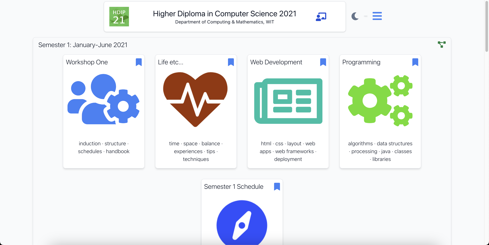

# The Tutors Project

A Final Report by Jordan Harrison

Higher Diploma in Computer Science

Department of Computing & Mathematics, SETU Waterford

20095937@mail.wit.ie / contact@jordanharrison.ie

# Table of Contents

[toc]

# Introduction

## Background

The Tutors Open Source Project is a collection of components & services supporting the creation of transformative learning experiences using open web standards. The project supports 3 complementary perspectives - the Learner, Educator & Developer experiences. It was originally developed by Eamonn de Leastar, beginning around 10 years ago as a python application with similar principles as it has today - ingesting markdown content to generate either a static site or a zip file which could be uploaded as a lab to Moodle. It has evolved over the past decade, keeping to the same principles, but has been adapted to use modern technologies.

I initially approached Eamonn De Leastar, SETU Lecturer & the developer on Tutors, on the 3rd June 2021 with my intentions of setting up Tutors on my local machine in order to learn the codebase and update the user experience for the learner. Since then I have actively worked on the project. Although it is unorthodox, I organically onboarded to the Tutors project early on in the course, and as a result grew as a developer because of Tutors and built something that I am proud of.

## Objectives

My objectives for this project were as follows:

1. Create a more engaging learner experience, with a fresh, modern interface &
improved user experience.
2. Improve the developer experience by creating a monorepo and tidying up the
codebase.
3. Open up the project to contributions from the open source developer community.
4. Bring exposure to the Tutors Open Source Project by presenting it to a wider
audience.

## Motivation

I initially wanted to get on board with the project after semester 1, where I was a user of Tutors daily. I found the user experience of the software was lacking - it needed to be explained to a learner instead of being self explanatory. I wanted to get my hands on the codebase to modernise the frontend design, selfishly, to make Tutors easier to navigate for myself for the duration of the course. Over time, I gained an acute appreciation for Tutors and became actively involved in the project - which is why I chosen this as my final project. 

# Getting on board

## Initial Technologies & User Experience

The initial frontend of Tutors when I started the course was built with Aurelia and used UI Kit for the design (see fig. 1). By the time I had started working on Tutors it had been upgraded to be built with Svelte and TailwindCSS (see fig. 2).

Figure 1 - Tutors Aurelia

Figure 2 - Tutors Svelte

## Initial Setup & Research

As a student early on in the course, I was not very familiar with frontend development. I spend multiple evenings getting used to the codebase - learning to use Git to get the code, learning to run the code on my local machine & learning my way around the codebase to figure out what does what. I then decided to research the tech stack being used, Svelte & TailwindCSS, and put out feelers to see what UI libraries were out there that would work with this tech stack that would provide a more compelling user experience. This was when I came across [Daisy UI](https://daisyui.com), an open source UI component library built on top of TailwindCSS that provided component classes that simplifies the building of a User Interface.

## Implementing DaisyUI

After ensuring all aspects of Tutors would be covered by DaisyUI's component library, I decided to go ahead and start implementing DaisyUI in Tutors. The initial wireframe was built using TailwindCSS & DaisyUI using Stackblitz, an online code editor. The code for this can be found [here](https://stackblitz.com/edit/daisyui-svelte-vite-cfhqdw?file=src/App.svelte).

During the implementation of DaisyUI I experimented with the colour styles, implemented the [theme-switch](https://github.com/saadeghi/theme-change) for dark mode & changing themes and the [iconify](https://icon-sets.iconify.design) package for icons. In below figures 3 - 7 I have provided work in progress screenshots of this implementation.

Figure 3 - Tutors early wireframe with DaisyUI

Figure 4 - Tutors early wireframe - mobile responsiveness

Figure 5 - Early work in progress implementing DaisyUI in Tutors

Figure 6 - Mid work in progress implementing DaisyUI in Tutors

Figure 7 - Late work in progress implementing DaisyUI in Tutors

# Tutors Tech Team

## Red Hat Onboarding

In August 2021, after a successful build & release of Tutors using DaisyUI, Eamonn approached me asking if I would like to join the Tutors 'tech team'. Red Hat had agreed to commit resources for further development of Tutors, appointing a project manager & 2 engineers to work on Tutors 1 day a week, with a weekly meeting to chat about progress on the project. I was, of course, thrilled to be part of the team and contribute further to the UX of Tutors.

# State of the Art

UX Design Systems & CSS Frameworks
Front End Frameworks
Build Systems
Open Source Patterns & infrastructure

# Tutors Architecture

Articulate the core of the system as presented on the Slides

# The Tutors Monorepo

TODO

# The Tutors Design System

TODO

# The Tutors Open Source Infrastructure

TODO

# Conclusion + Further work

